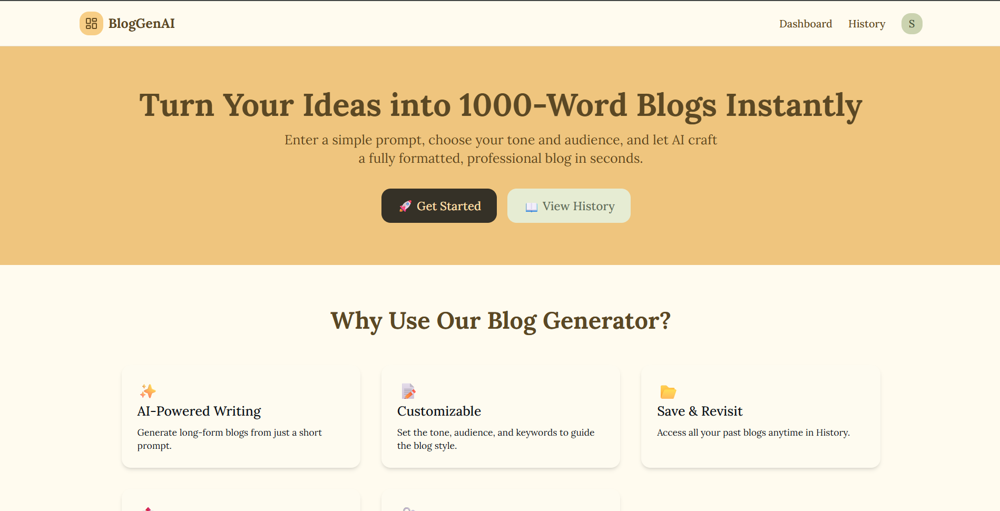

# BlogGenAI 🚀

Welcome to **BlogGenAI**, a sleek and secure web application for generating, managing, and tracking blog content. Built by Shiva Gheji, this full-stack project combines a React frontend with a Node.js/Express backend, offering a user-friendly experience for bloggers and developers. Deployed with the frontend on Vercel and backend on Render, it showcases modern web development practices.


_Preview of the BlogGenAi Interface_

## 📋 Table of Contents

- [Overview](#-overview)
- [Features](#-features)
- [Tech Stack](#%EF%B8%8F-tech-stack)
- [Getting Started](#-getting-started)
  - [Prerequisites](#prerequisites)
  - [Installation](#installation)
  - [Environment Setup](#environment-setup)
- [Usage](#-usage)
- [API Documentation](#-api-documentation)
- [Security](#-security)
- [Deployment](#-deployment)
- [Future Improvements](#-future-improvements)
- [Contributing](#-contributing)
- [Contact](#-contact)

## 🌟 Overview

BlogGenAI is a secure web application that allows users to generate AI-powered blog posts with customizable parameters like keywords, tone, and target audience. Built with modern web technologies, it features robust authentication, CSRF protection, and a responsive design that works seamlessly across all devices.

**Live Demo:** [https://blog-gen-ai-rose.vercel.app](https://blogenai.vercel.app)

## ✨ Features

### Authentication & User Management

- **Secure Sign-Up/Sign-In** - Register and login with email/password
- **JWT Authentication** - Users are authenticated via JWT tokens that are stored in secure httpOnly
- **CSRF Protection** - Prevents cross-site request forgery attacks
- **Protected Routes** - Secure access to user-specific content

### Blog Generation & Management

- **AI-Powered Blog Creation** - Generate ~1000 word blogs from prompts
- **Customizable Parameters**:
  - Keywords selection
  - Tone (friendly, professional, casual, etc.)
  - Target audience (students, developers, general, etc.)
- **Blog Dashboard & History** - View and manage all your created blogs
- **Blog Actions**:
  - 📋 Copy to clipboard
  - 💾 Download as Markdown/Text file
  - 🗑️ Delete blogs
  - 📊 View metadata (word count, creation date)

### User Experience

- **Responsive Design** - Mobile-first approach with Tailwind CSS
- **Real-time Feedback** - Toast notifications for all actions
- **Loading States** - Skeleton loaders and spinners
- **Error Handling** - User-friendly error messages

## 🛠️ Tech Stack

### Frontend

- **React.js** (Vite) - Fast and modern React setup
- **React Router** - Client-side routing
- **Tailwind CSS** - Utility-first CSS framework
- **Axios** - HTTP client with interceptors
- **React Context API** - Global state management
- **Lucide React** - Beautiful icon library
- **React Markdown** - Render markdown content
- **React Hook Form + Zod** - Form validation

### Backend

- **Node.js** - JavaScript runtime
- **Express.js** - Web application framework
- **MongoDB** - NoSQL database for users and blogs
- **JWT** - Secure authentication tokens
- **Bcrypt** - Password hashing
- **CORS** - Cross-origin resource sharing
- **Helmet** - Security headers
- **Express Rate Limit** - API rate limiting

### Deployment

- **Frontend:** Vercel
- **Backend:** Render
- **Database:** MongoDB Atlas

## 🚀 Getting Started

### Prerequisites

Before you begin, ensure you have the following installed:

- Node.js (v14.0 or higher)
- npm package manager
- MongoDB (local or Atlas account)
- Git

### Installation

1. **Clone the repository**

```bash
git clone https://github.com/ShivaGheji/BlogGenAi.git
cd BlogGenAi
```

2. **Install Frontend Dependencies**

```bash
cd frontend
npm install
```

3. **Install Backend Dependencies**

```bash
cd ../backend
npm install
```

### Environment Setup

1. **Backend Configuration**

- Copy the .env.example environment file and update it with your own values.

```env
cp backend/.env.example server/.env
```

2. **Frontend Configuration**

```env
VITE_API_BASE=http://localhost:5500/api
```

3. **Start MongoDB** (if running locally)

```bash
mongod
```

4. **Run the Backend Server**

```bash
cd backend
npm run dev
```

5. **Run the Frontend Application**

```bash
cd frontend
npm run dev
```

6. **Access the Application**
   Open your browser and navigate to `http://localhost:5173`

## 💻 Usage

### Creating Your First Blog

1. **Sign Up** - Create a new account with your email and password
2. **Sign In** - Login with your credentials
3. **Generate Blog** - Click "Generate New Blog" on the dashboard
4. **Configure Settings**:
   - Enter your topic/prompt
   - Add relevant keywords
   - Select tone and audience
5. **Generate** - Click generate and wait for AI to create your blog
6. **Manage** - View, edit, copy, or download your blog

### Managing Your Blogs

- **View History** - Access all your generated blogs from the dashboard
- **Export** - Download blogs in Markdown or Text format
- **Delete** - Remove unwanted blogs permanently

## 📚 API Documentation

### Authentication Endpoints

| Method | Endpoint             | Description       |
| ------ | -------------------- | ----------------- |
| POST   | `/api/auth/sign-up`  | Register new user |
| POST   | `/api/auth/sign-in`  | User login        |
| POST   | `/api/auth/sign-out` | User logout       |
| GET    | `/api/auth/me`       | Get current user  |
| GET    | `/api/auth/csrf`     | Get CSRF token    |

### Blog Endpoints

| Method | Endpoint              | Description       |
| ------ | --------------------- | ----------------- |
| POST   | `/api/blogs/generate` | Generate new blog |
| GET    | `/api/blogs`          | Get user's blogs  |
| GET    | `/api/blogs/:id`      | Get specific blog |
| DELETE | `/api/blogs/:id`      | Delete blog       |

### Request/Response Examples

**Generate Blog Request:**

```json
{
  "prompt": "Write about web development trends",
  "keywords": ["React", "Node.js", "AI"],
  "tone": "professional",
  "targetAudience": "developers"
}
```

**Blog Response:**

```json
{
  "status": "success",
  "data": {
    "_id": "blog123",
    "user": "12345gfdsaqweaababababab",
    "title": "Web Development Trends in 2025",
    "tone": "professional",
    "targetAudience": "developers",
    "keywords": ["React", "Node.js", "AI"],
    "wordCount": 932,
    "content": "...",
    "createdAt": "2025-09-11T16:28:09.125Z"
  }
}
```

## 🔒 Security

BlogGenAI implements multiple security measures:

- **Password Security** - Bcrypt hashing with salt rounds
- **JWT Tokens** - Stored in httpOnly cookies
- **CSRF Protection** - Token validation for state-changing operations
- **Rate Limiting** - Prevents API abuse
- **Input Validation** - Zod schema validation
- **CORS Configuration** - Restricted origins

## 🌐 Deployment

### Deploy Frontend to Vercel

1. Push your code to GitHub
2. Connect repository to Vercel
3. Set environment variables
4. Deploy

### Deploy Backend to Render

1. Create new Web Service on Render
2. Connect GitHub repository
3. Set environment variables
4. Deploy

### Database Setup (MongoDB Atlas)

1. Create free cluster on MongoDB Atlas
2. Set up database user
3. Whitelist IP addresses
4. Get connection string
5. Update MONGODB_URI in backend .env

## 🔮 Future Improvements

- **Optimized Tailwind CSS Usage** - Centralize styling with a custom theme file, define a consistent color palette, and use utility classes more efficiently for scalability.
- **Enhanced Authentication** - Integrate OAuth for seamless sign-in options, improving user onboarding.
- **User Profile Functionalities** - Add avatar uploads, Update passwords, etc.
- **Dark Mode Support** - Add light/dark theme support using Tailwind CSS.

## 🤝 Contributing

1. Fork the repository
2. Create a feature branch (`git checkout -b feature/amazing-feature`)
3. Commit your changes (`git commit -m 'Add amazing feature'`)
4. Push to the branch (`git push origin feature/amazing-feature`)
5. Open a Pull Request

## 📞 Contact

**Shivanand Gheji**

- Email: shivagheji310@gmail.com
- LinkedIn: [shivagheji](https://www.linkedin.com/in/shivagheji/)

---

<p align="center">Made with ❤️ by Shiva Gheji © 2025 BlogGenAI. All rights reserved.</p>
